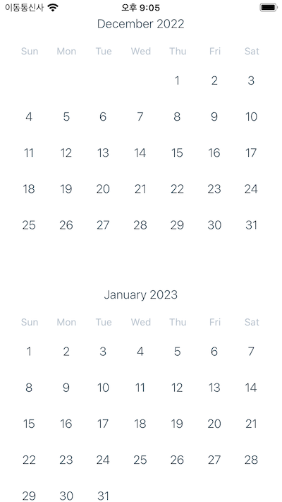
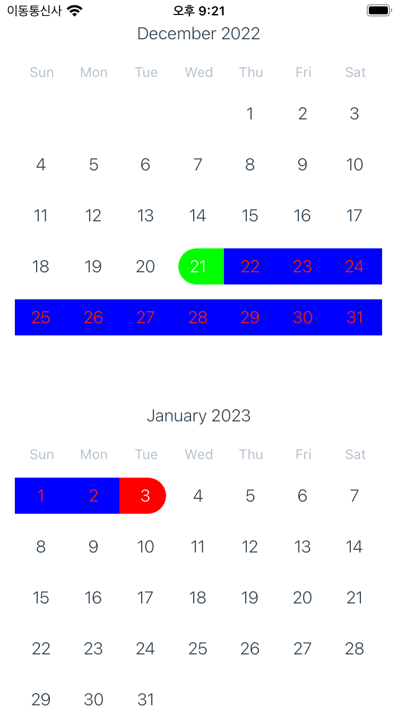

# 캘린더 라이브러리

react-native-calendar: https://github.com/wix/react-native-calendars

## 기본 UI

</img>

## 스크롤 동작

</img>

## 날짜 선택 UI

</img>

### 커스텀 가능 속성

- 배경색
- 폰트
- 타이틀 글자 색
- 날짜 글자 색
- 선택 날짜 배경색
- 선택 날짜 글자 색
  ... 등
  참고: https://github.com/wix/react-native-calendars#customizing-look--feel
